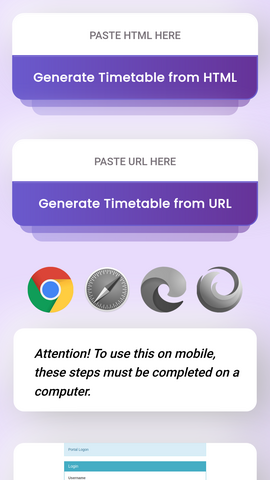
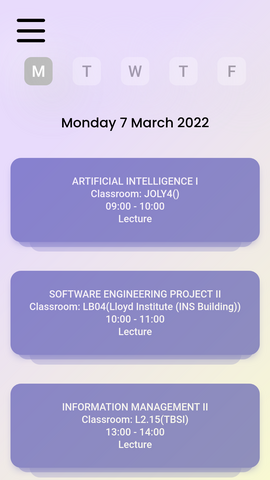
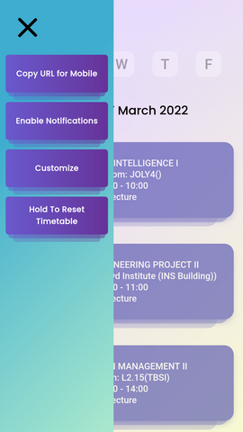

# 2021-2022-Timetable

I created a Progressive Web App in React that acts as my college timetable that is accessible offline and visually customizable. Any Trinity College Student can use this application to create and share their own timetable!.

---

<a href="https://frontrowwithj.github.io/2021-2022-timetable/">Link To Website</a>

  
  
  

